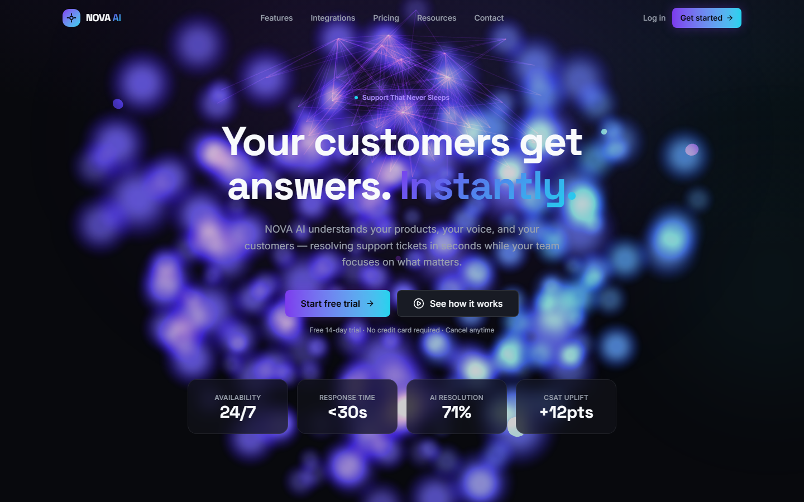
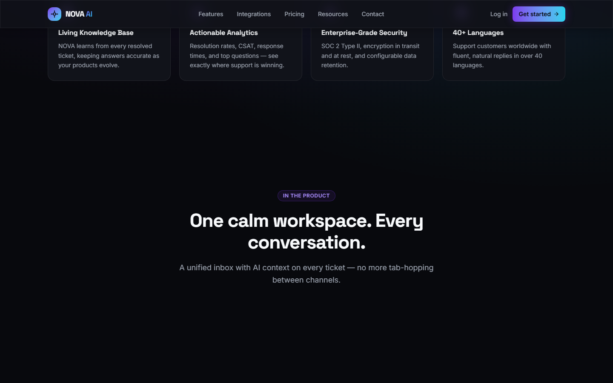
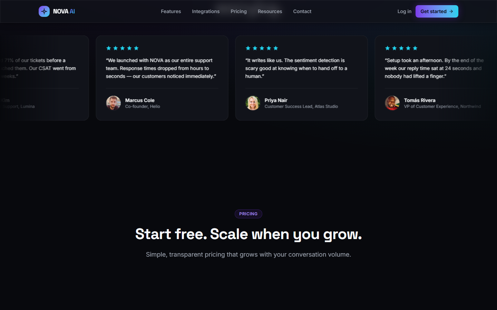
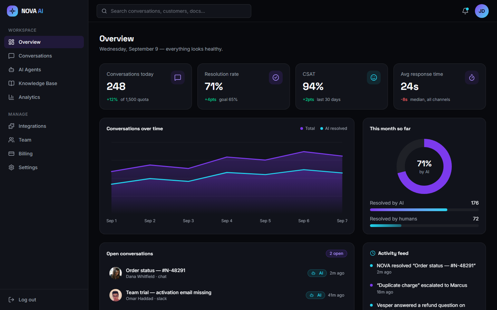
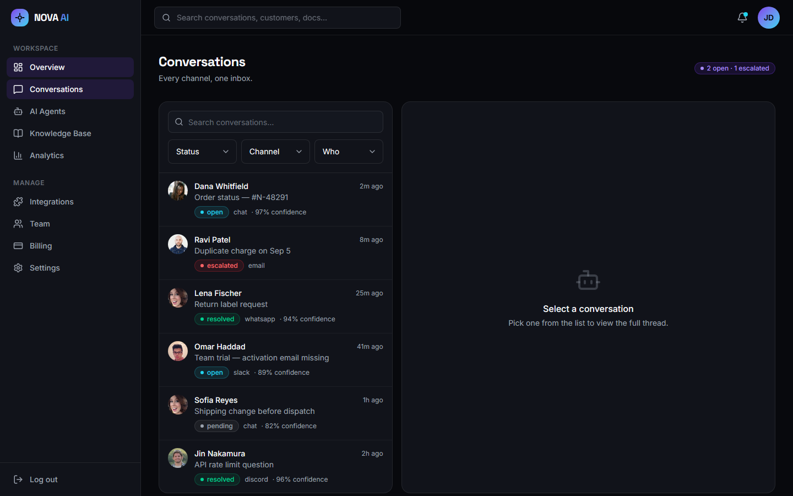
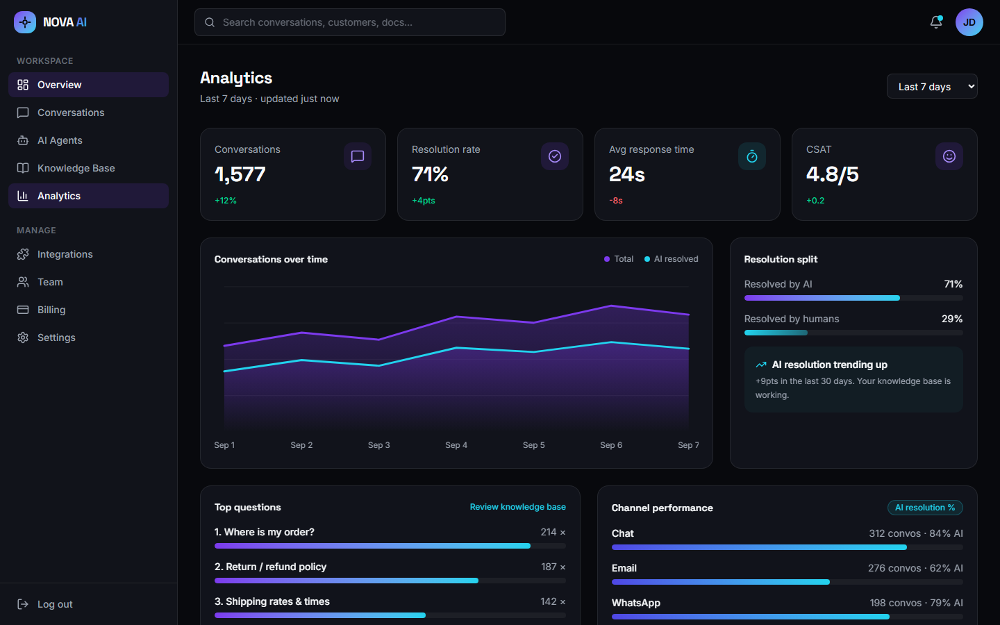

# NOVA AI

A front-end demo of an AI customer-support SaaS. Landing page, real-looking live demo, and a full dashboard — all mocked up, no backend.

**Live demo:** [https://novaai-virid.vercel.app/](https://novaai-virid.vercel.app/)

I built this to practice putting together a polished, complete product surface: a marketing site that sells the product, and a dashboard that shows what using it would actually feel like (conversations, agents, analytics, billing, team, knowledge base). The data is all fake, the "AI" is scripted, but the UI is real.

## Screenshots

**Landing page — hero with a live Three.js neural network**



**Landing page — features & live demo section**



**Landing page — customer feedback marquee**



**Dashboard — overview**



**Dashboard — conversations inbox**



**Dashboard — analytics**



## Tech Stack

| What | How |
|---|---|
| Build | [Vite](https://vitejs.dev/) 8 + React 19 + TypeScript |
| Styling | Tailwind CSS v4 (dark design system via CSS tokens) |
| Animation | framer-motion |
| 3D | Three.js + react-three/fiber + drei |
| Icons | lucide-react, simple-icons (real brand logos) |
| Charts | hand-rolled SVG (no chart library) |
| Routing | react-router-dom |
| QA | puppeteer-based script that walks every route |

## What's In Here

**Marketing site**
- Animated hero with a full-bleed animated neural network (`react-three/fiber`)
- Working interactive AI demo (type a message, get a scripted AI-style reply)
- Features deep-dive, how-it-works, integrations grid with real brand logos, pricing, FAQ, resources/blog, contact form (fake submit)
- Testimonial marquee that scrolls right-to-left

**Dashboard**
- Overview with stats, charts, and recent activity
- Conversations inbox with customer threads, AI/human resolution tags, and customer panels
- AI agents config (personality, tone, channels, limits)
- Team members, knowledge base with add-document flow, analytics, billing with plan switching + invoices, settings, integrations with connect/disconnect
- Auth pages (login/signup) with a branded split-panel layout

The whole thing is routed under two shells: the public marketing pages, and `/app/*` for the dashboard.

## Running Locally

```bash
npm install
npm run dev
```

Then open the printed local URL (usually http://localhost:5173).

**Dashboard demo login** — use the "Use demo credentials" button on the login page, or enter:

```
demo@nova.ai
novademopass
```

Production build + preview:

```bash
npm run build   # type-check + build
npm run preview # serve the build
```

## Checks

```bash
npm run lint
node scripts/verify.mjs   # walks every route in headless Chrome and checks content
```

`verify.mjs` boots a local Vite server, visits all 11 routes, and fails if any of them throw console errors or miss expected content. Useful before shipping the build.

## Structure

```
src/
  components/
    marketing/    # public site sections
    dashboard/    # shared dashboard bits (sidebar, page header, stat cards)
    auth/         # auth layout + forms
    ui/           # smaller reusable primitives (Button, Card, Avatar, Marquee…)
    three/        # 3D scene + neural network
    mocking/      # dashboard-like mockups used on the landing page
  pages/          # route-level pages, split marketing/ and dashboard/
  data/           # all the mock content (conversations, docs, pricing…)
  lib/            # helpers, brand-icon library
  hooks/
  types/
scripts/
  verify.mjs      # route walker / content checks
```

## Notes

- This is purely a front-end exercise. No server, no auth, no persistence — conversations, invoices, and tickets reset on refresh.
- Customer photos come from [randomuser.me](https://randomuser.me) and load at runtime, so the nice avatars need internet.
- The "AI" in the demo is a canned response loop. The real trick is that it never quite feels canned.